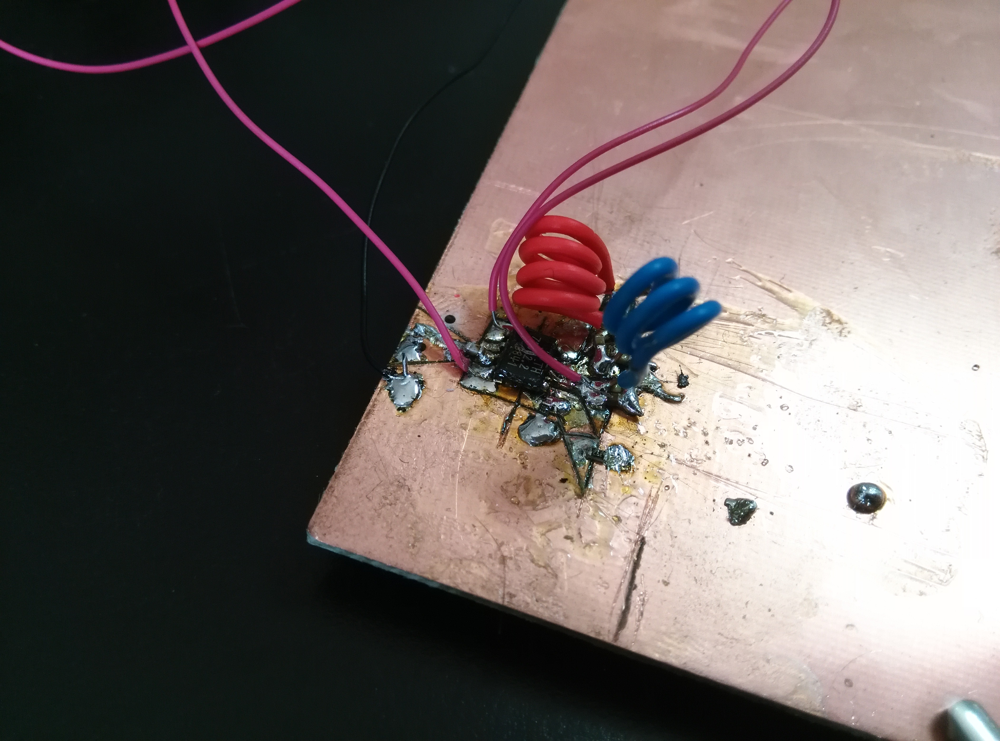
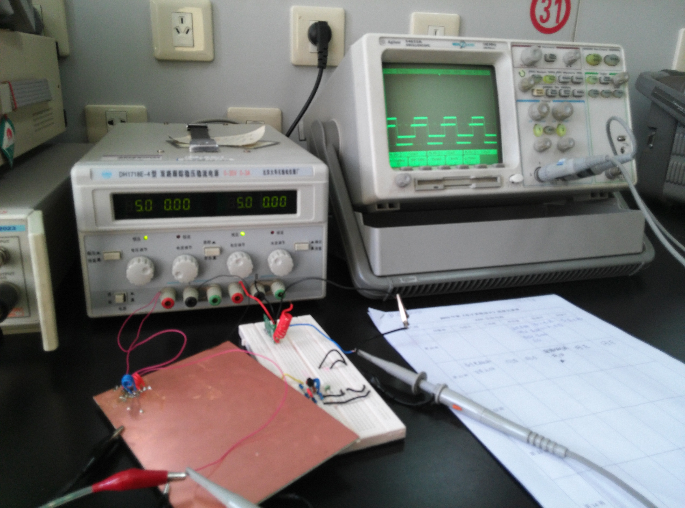
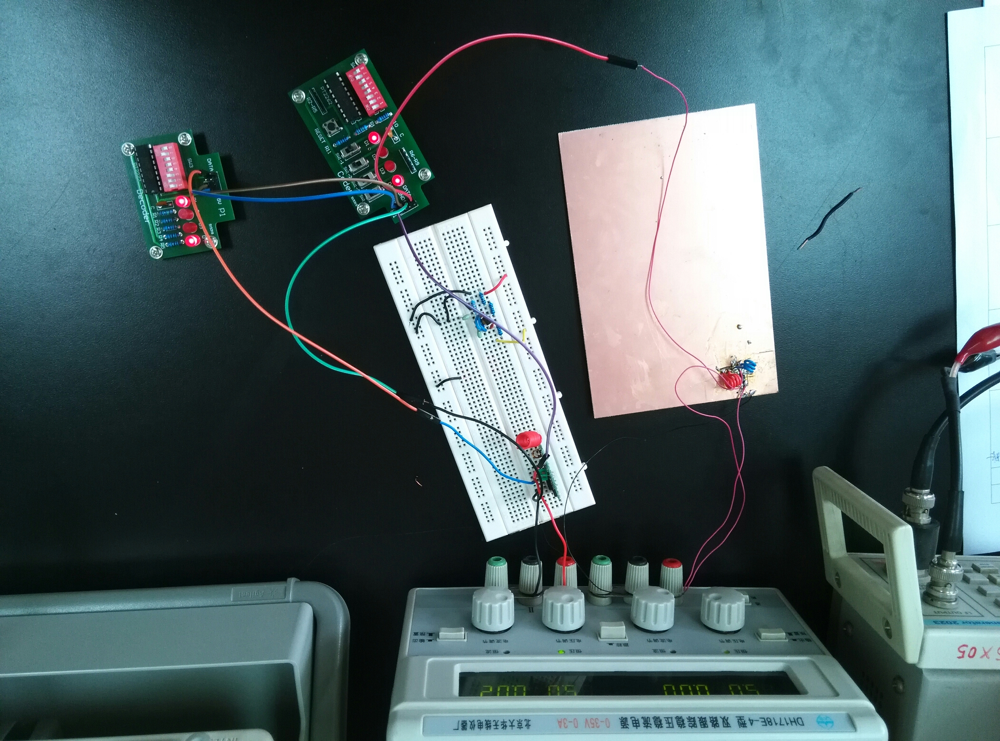
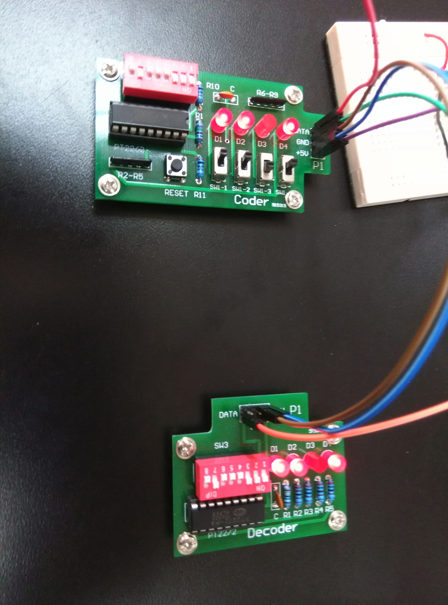

# 315MHz ASK Transmission Circuit

We use the TH72002 chip in our circuit, whose datasheet can be found in attachment.

We tried to apply the test circuit in datasheet provided by Melexis. See below:
 

The parameters of design:
 

### 设计简介

Multisim 14中没有TH72002芯片，本文采用的是自己添加封装。

### 附件

附件包含Multisim电路图以及ultiboard制板用图。命名为“PCBUse”的文件只是为了制板使用，只为了看封装信息，所以相同封装的表面表贴的器件均用电容替代。最终的PCB图仍然有2处错误，不过印制的时候可以用碳素笔画上。

Ultiboard图纸有一些小问题，需要后期手工用刻刀和焊锡进行了修改（已制板验证无误），见下：

### 最终成果

多次尝试印制板子失败后（由于印刷过程中腐蚀溶液浓度过大或腐蚀时间过长等原因），直接在整块铜板上用刻刀刻开元件管脚所在的区域制板成功。手工焊接表面面贴装元件制成发射电路：
 

经验证，发射电路可以正确发射出315MHz的ASK调制信号，下图为示波器对比发射的方波信号与接收端复原的方波信号：

经测试，驱动发射电路的方波频率19.93kHz时为正确接收的阈值，频率过高则导致接收模块无法正确复原调制波形。由此无法确定发射模块的驱动频率上届，因为无法正确接收也可能是接收模块达到阈值所致。用频率分析仪直接分析发射模块辐射出来的电磁波的频谱我们推断，方波频率低于100kHz时辐射出的电磁波频谱仍然正确，应该可以被正确接收。由于使用的函数信号发生器最高频率为100kHz，无法得知更高频率的方波驱动电路时的表现。

发射电路可以加装编解码模块构成完整的通信系统：

解调模块可以正确得到调制模块的编码：
