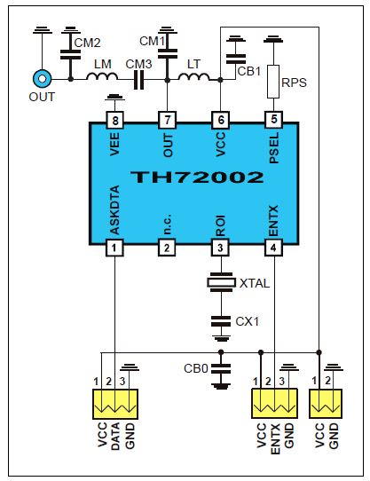
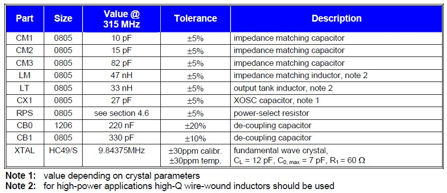
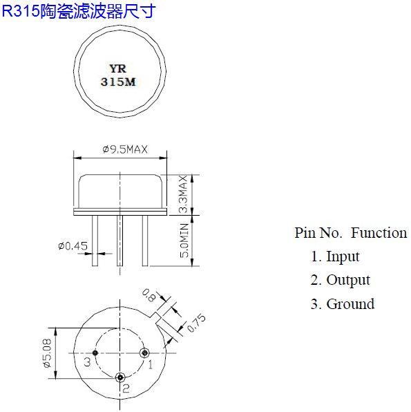

# 315MHz ASK Transmission Circuit

We use the TH72002 chip in our circuit, whose datasheet can be found in attachment.

We tried to apply the test circuit in datasheet provided by Melexis. See below:
 

The parameters of design:
 

### 设计简介

Multisim 14中没有TH72002芯片，本文采用的是自己添加封装。同样的，晶振R315也没有出现在元件库中，也是自己添加封装。注意好管教对应关系就可以。采用的R315参数如下：
 